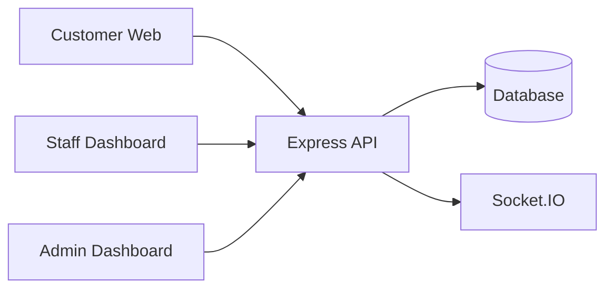

<div align="center">

# 🍽️ Restaurant Management System

### Enterprise Restaurant Operations Platform

A modern full-stack platform that streamlines restaurant operations through dedicated applications for customers, staff, and administrators.

<p>


</p>

<p>

<a href="https://your-live-demo.com">


</a>

<a href="https://github.com/yourusername">


</a>

<a href="https://yourportfolio.com">


</a>

</p>

</div>

---

# 📖 Overview

Restaurant Management System is a production-oriented multi-application platform built to digitize restaurant operations. Instead of combining every feature into one application, the system separates responsibilities into dedicated interfaces for customers, restaurant staff, and administrators, communicating through a centralized backend API.

This architecture improves maintainability, scalability, and user experience while demonstrating modern full-stack engineering practices.

---

# 🌟 Why This Project?

Restaurants often manage reservations, staff operations, orders, and administration using disconnected tools.

This platform centralizes those workflows into one ecosystem that supports:

- Customer interactions
- Restaurant staff operations
- Administrative management
- Real-time communication
- Secure API services
- Scalable architecture

---

# 🚀 Applications

## 🍽 Customer Web

- Browse restaurant information
- View menus
- Place orders
- Responsive interface
- API integration

---

## 👨‍🍳 Staff Dashboard

- Order management
- Kitchen workflow
- Daily operations
- Status updates

---

## 👨‍💼 Admin Dashboard

- Restaurant analytics
- User management
- Staff management
- Menu management
- Operational oversight

---

## ⚙ Backend API

- RESTful APIs
- Authentication
- Business logic
- Database access
- Socket.IO communication
- Shared services

---

# 🛠 Technology Stack

| Layer | Technologies |
|--------|--------------|
| Customer App | React, Vite, TypeScript |
| Staff Dashboard | React, TypeScript |
| Admin Dashboard | React, TypeScript |
| Backend | Node.js, Express.js |
| Language | TypeScript |
| Communication | Axios, Socket.IO |
| CI/CD | GitHub Actions |
| Version Control | Git & GitHub |

---

# 🏛 System Architecture



---

# 📂 Repository Structure

```text
Restaurant-Management-System

├── customer-web
│   ├── src
│   ├── features
│   ├── components
│   └── lib
│
├── staff-dashboard
│   ├── src
│   ├── stores
│   └── lib
│
├── admin-dashboard
│   ├── src
│   ├── stores
│   └── lib
│
├── server
│   ├── src
│   ├── controllers
│   ├── routes
│   ├── middleware
│   ├── services
│   └── config
│
└── .github
    └── workflows
```

---

# ✨ Engineering Highlights

- Multi-application architecture
- Feature-based frontend organization
- Shared backend services
- RESTful API design
- Real-time communication with Socket.IO
- TypeScript across the stack
- Centralized authentication
- Modular project organization
- CI-ready repository
- Scalable SaaS-style architecture

---

# 🚀 Getting Started

```bash
git clone https://github.com/yourusername/Restaurant-Management-System.git
```

Install dependencies for each application:

```bash
cd customer-web
npm install

cd ../staff-dashboard
npm install

cd ../admin-dashboard
npm install

cd ../server
npm install
```

Run each application independently during development.

---

# 🧪 Development Workflow

1. Start the backend API.
2. Launch the Customer Web.
3. Launch the Staff Dashboard.
4. Launch the Admin Dashboard.
5. Verify API and real-time communication.

---

# 📈 Future Roadmap

- Online payment integration
- Inventory management
- Table reservations
- QR code ordering
- Kitchen display system
- Push notifications
- Multi-branch management
- AI-powered demand forecasting
- Business analytics dashboard

---

# 👨‍💻 About the Developer

**Saif Ul Islam**

Full Stack MERN Developer | AI Application Developer

- 🌐 Portfolio: `https://your-portfolio.com`
- 💼 LinkedIn: `https://linkedin.com/in/your-profile`
- 🐙 GitHub: `https://github.com/Saif0122`

---

# ⭐ Support

If you found this project useful, consider giving it a **Star** on GitHub.
